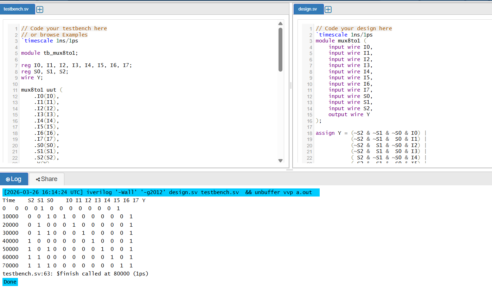

# verilog-8to1-mux
A Verilog HDL project implementing a 8:1 Multiplexer with testbench and simulation.
# 8:1 Multiplexer (MUX)

## Overview
This project implements an **8:1 Multiplexer (MUX)** in Verilog.

A multiplexer is a digital circuit that selects **one input out of many inputs** and sends it to a **single output**.

In this case:
- There are **8 inputs** → `I0` to `I7`
- There are **3 select lines** → `S2, S1, S0`
- There is **1 output** → `Y`

Depending on the select lines, the output `Y` will match one of the 8 inputs.

---

## What This Project Does
In this project, I created a simple **8:1 MUX RTL design** and verified it using a **testbench**.

### Specifically, this project includes:
- Verilog RTL code for the **8:1 multiplexer**
- A testbench to check all **8 select combinations**
- Simulation to confirm that the output changes correctly
- Clean and beginner-friendly code for learning and portfolio use

---

## How It Works
The select lines decide which input should appear at the output.

### Selection logic:
- `S2 S1 S0 = 000` → `Y = I0`
- `S2 S1 S0 = 001` → `Y = I1`
- `S2 S1 S0 = 010` → `Y = I2`
- `S2 S1 S0 = 011` → `Y = I3`
- `S2 S1 S0 = 100` → `Y = I4`
- `S2 S1 S0 = 101` → `Y = I5`
- `S2 S1 S0 = 110` → `Y = I6`
- `S2 S1 S0 = 111` → `Y = I7`

---

## Files Included
- `mux8to1.v` → Verilog RTL code
- `tb_mux8to1.v` → Testbench for simulation

---

## Expected Output

| S2 | S1 | S0 | Selected Input | Output Y |
|----|----|----|----------------|----------|
| 0  | 0  | 0  | I0             | I0       |
| 0  | 0  | 1  | I1             | I1       |
| 0  | 1  | 0  | I2             | I2       |
| 0  | 1  | 1  | I3             | I3       |
| 1  | 0  | 0  | I4             | I4       |
| 1  | 0  | 1  | I5             | I5       |
| 1  | 1  | 0  | I6             | I6       |
| 1  | 1  | 1  | I7             | I7       |

This means the output `Y` always follows the input selected by the 3 select lines.

---

## How to Run
1. Open **EDA Playground** or any Verilog simulator
2. Copy `mux8to1.v` into the design file
3. Copy `tb_mux8to1.v` into the testbench file
4. Run the simulation
5. Check the console output or waveform

---

## Conclusion
This project is a simple example of **combinational logic design in Verilog**.

- How select lines control data flow
- How to write and test basic RTL modules
- How to build clean beginner-friendly VLSI portfolio projects

## Simulation Output

